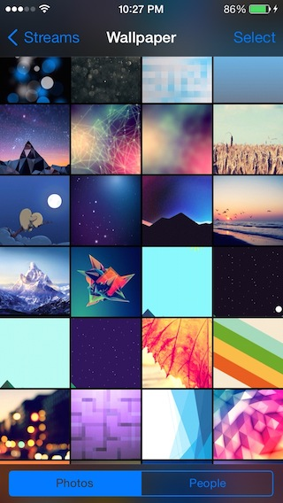
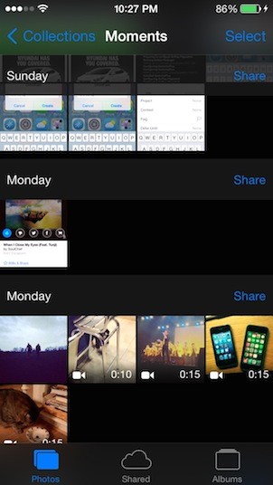
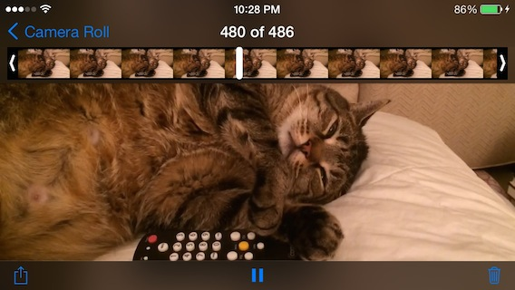

# DarkPhotos

Dark, beautiful Photos (MobileSlideShow) app. Compiled for all devices (unlike BlackTranslucentPhotos). More of a proof-of-concept than a full fledged tweak.

Cydia icon by the wonderful afrokat980 (Derek). Supports iOS 7-8.

## [License](LICENSE.md)

	DarkPhotos: Dark, beautiful Photos app
	Copyright (C) 2014  Julian (insanj) Weiss
	
    This program is free software: you can redistribute it and/or modify
    it under the terms of the GNU General Public License as published by
    the Free Software Foundation, either version 3 of the License, or
    (at your option) any later version.

    This program is distributed in the hope that it will be useful,
    but WITHOUT ANY WARRANTY; without even the implied warranty of
    MERCHANTABILITY or FITNESS FOR A PARTICULAR PURPOSE.  See the
    GNU General Public License for more details.

    You should have received a copy of the GNU General Public License
    along with this program.  If not, see <http://www.gnu.org/licenses/>.